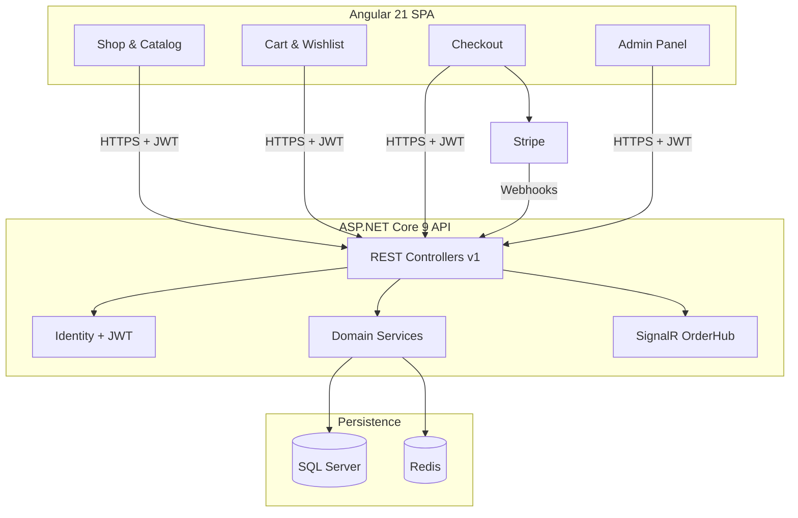

# Natures Chakki

A full-stack e-commerce platform for artisan flour and grain products — built as a **modular monolith** with ASP.NET Core 9 and Angular 21.

[](https://dotnet.microsoft.com/)
[](https://angular.dev/)
[](https://www.microsoft.com/sql-server)
[](https://stripe.com/)

## Overview

Natures Chakki demonstrates production-grade e-commerce patterns: JWT authentication with refresh tokens, Stripe payments, inventory management, coupon validation, admin moderation, and pluggable Redis/Memory caching — all in a clean layered architecture suitable for portfolio and interview discussion.



## Features

- **Catalog** — Paginated product listing with brand/type filters and specifications pattern
- **Cart** — Anonymous carts with Memory or Redis backing (`CacheProvider`)
- **Orders** — Stock reservation, delivery methods, order lifecycle management
- **Payments** — Stripe Payment Intents with webhook confirmation (mock mode for dev)
- **Coupons** — Percentage and fixed discounts with usage limits
- **Wishlist** — Per-user saved products
- **Reviews** — Customer reviews with admin moderation
- **Admin** — Product, order, coupon, and review management
- **Auth** — Identity, JWT, refresh tokens, role-based access (Admin / Customer)
- **Real-time** — SignalR order status notifications

## Tech Stack

| Layer | Technology |
|-------|------------|
| API | ASP.NET Core 9, EF Core 9, Serilog, FluentValidation |
| Auth | ASP.NET Identity, JWT Bearer, refresh tokens |
| Frontend | Angular 21, Angular Material, Tailwind CSS 4 |
| Database | SQL Server 2022 |
| Cache | In-memory / Redis (StackExchange.Redis) |
| Payments | Stripe.net |
| Tests | xUnit, WebApplicationFactory, Vitest |
| DevOps | Docker, Docker Compose, Azure Pipelines |

## Project Structure

```
├── API/                 # Controllers, middleware, hubs, Program.cs
├── Core/                # Entities, DTOs, interfaces, specifications
├── Infrastructure/      # EF contexts, services, migrations, validators
├── Tests/               # Unit + integration tests
├── client/              # Angular 21 SPA
├── docs/                # Architecture & feature documentation
├── Dockerfile           # Multi-stage API image
├── docker-compose.yml   # SQL Server + Redis + API
└── azure-pipelines.yml  # CI/CD pipeline
```

## Quick Start

### Prerequisites

- .NET 9 SDK
- Node.js 20+
- Docker

### 1. Start infrastructure

```bash
docker compose up -d
```

### 2. Run the API

```bash
dotnet run --project API
```

API: https://localhost:5001 · Swagger: https://localhost:5001/swagger

### 3. Run the frontend

```bash
cd client && npm install && npm start
```

App: http://localhost:4200

### 4. Login

| Role | Email | Password |
|------|-------|----------|
| Admin | admin@natureschakki.com | Admin@123! |
| Customer | customer@natureschakki.com | Customer@123! |

Migrations and seed data run automatically on first API start in Development.

## Configuration

Key settings in `API/appsettings.json`:

```json
{
  "ConnectionStrings": {
    "DefaultConnection": "Server=localhost,1433;Database=NaturesChakki;...",
    "Redis": "localhost:6379"
  },
  "CacheProvider": "Memory",
  "JwtSettings": { "Key": "...", "DurationInMinutes": 60 },
  "StripeSettings": { "SecretKey": "...", "WebhookSecret": "..." }
}
```

Copy `.env.example` for local environment variable overrides.

## Testing

```bash
dotnet test Tests/Tests.csproj
cd client && npm test
```

22 automated tests + documented E2E scenarios. See [docs/07-Testing.md](docs/07-Testing.md).

## Documentation

| Doc | Topic |
|-----|-------|
| [01-Architecture](docs/01-Architecture.md) | Layers, bounded contexts, diagrams |
| [02-Getting-Started](docs/02-Getting-Started.md) | Setup, migrations, run commands |
| [03-Database](docs/03-Database.md) | Schema, ER diagram, indexes |
| [04-Authentication](docs/04-Authentication.md) | Identity, JWT, refresh tokens |
| [05-Caching](docs/05-Caching.md) | Memory vs Redis |
| [06-Payments](docs/06-Payments.md) | Stripe flow, webhooks |
| [07-Testing](docs/07-Testing.md) | Test suites and scenarios |
| [08-Deployment](docs/08-Deployment.md) | Docker, Azure architecture |
| [09-Security](docs/09-Security.md) | CORS, rate limiting, secrets |
| [10-Features](docs/10-Feature-Documentation.md) | Feature reference |
| [Implementation Plan](docs/IMPLEMENTATION-PLAN.md) | Phase status tracker |

## Docker

```bash
docker compose up -d          # SQL + Redis + API
docker build -t natureschakki-api .
```

API container: http://localhost:8080

## License

This project is for portfolio and educational purposes.
