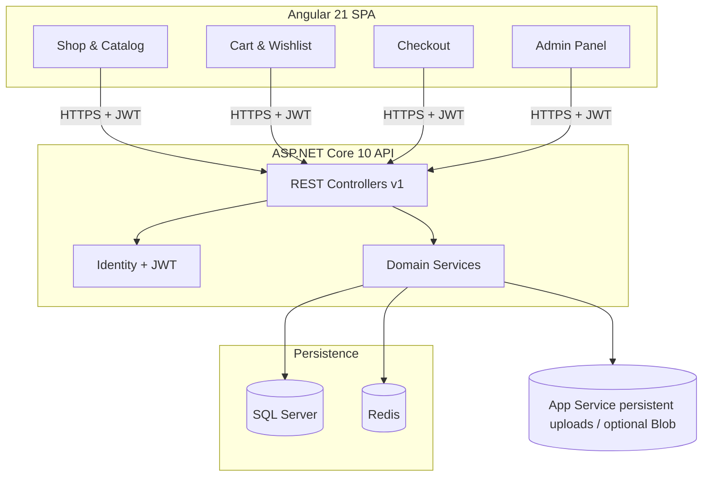

# Natures Chakki

A full-stack e-commerce platform for artisan flour and grain products — built as a **modular monolith** with ASP.NET Core 10 and Angular 21.

[](https://dotnet.microsoft.com/)
[](https://angular.dev/)
[](https://www.microsoft.com/sql-server)
[](https://stripe.com/)

## Overview

Natures Chakki implements verified registration, JWT/refresh-token authentication, secure password reset, server-authoritative carts priced per kilogram, transactional COD checkout, inventory history, customer order tracking, and a role-protected Admin Portal. The production package hosts Angular and the API together in one Azure App Service.


```mermaid
flowchart TB
    subgraph Frontend["Angular 21 SPA"]
        SHOP[Shop & Catalog]
        CART[Cart & Wishlist]
        CHK[Checkout]
        ADM[Admin Panel]
    end

    subgraph Backend["ASP.NET Core 10 API"]
        API[REST Controllers v1]
        ID[Identity + JWT]
        SVC[Domain Services]
    end

    subgraph Data["Persistence"]
        SQL[(SQL Server)]
        REDIS[(Redis)]
    end

    STORAGE[(App Service persistent uploads / optional Blob)]

    SHOP & CART & CHK & ADM -->|HTTPS + JWT| API
    API --> ID & SVC
    SVC --> SQL
    SVC --> REDIS
    SVC --> STORAGE
```

## Features

- **Catalog** — Paginated product listing with brand/type filters and specifications pattern
- **Cart** — Claims-bound customer carts, authoritative database prices, configurable kg limits, Memory or optional Redis storage
- **Orders** — Transactional COD checkout, stock deduction/reversal, validated lifecycle and status history
- **Payments** — COD is the active checkout method; Stripe backend/webhook support remains available for future online checkout
- **Coupons** — Percentage and fixed discounts with usage limits
- **Wishlist** — Per-user saved products
- **Reviews** — Customer reviews with admin moderation
- **Admin** — Dashboard, products/images, users, categories, inventory, orders, COD payments, reports, audit and alerts
- **Auth** — Email OTP activation, Identity password hashing, JWT/refresh tokens, single-use hashed password reset, Admin/Customer roles
- **Order tracking** — Customer and Admin status timelines

## Tech Stack

| Layer | Technology |
|-------|------------|
| API | ASP.NET Core 10, EF Core 10, Serilog, FluentValidation |
| Auth | ASP.NET Identity, JWT Bearer, refresh tokens |
| Frontend | Angular 21, Angular Material, Tailwind CSS 4 |
| Database | SQL Server 2022 |
| Cache | In-memory default / optional Redis |
| Files | Persistent App Service local storage default / optional Azure Blob |
| Payments | COD active; Stripe.net backend available |
| Tests | xUnit, WebApplicationFactory, Vitest |
| Deployment | One Azure App Service, manual PowerShell deployment scripts, Docker |

## Project Structure

```
├── API/                 # Controllers, middleware, Angular static host, Program.cs
├── Core/                # Entities, DTOs, interfaces, specifications
├── Infrastructure/      # EF contexts, services, migrations, validators
├── Tests/               # Unit + integration tests
├── client/              # Angular 21 SPA
├── docs/                # Architecture & feature documentation
├── scripts/             # Publish, Azure SQL and OpenAPI scripts
├── Dockerfile           # Multi-stage Angular + API image
├── docker-compose.yml   # SQL Server + Redis + API
└── global.json          # Pinned .NET 10 SDK
```

## Quick Start

### Prerequisites

- .NET 10 SDK
- Node.js 22
- Docker

### 1. Start infrastructure

```bash
cp .env.example .env
# Set MSSQL_SA_PASSWORD and JWT_SIGNING_KEY in .env.
docker compose up -d
```

### 2. Run the API

```bash
dotnet run --project API
```

API: https://localhost:5001 · Swagger: https://localhost:5001/swagger

### 3. Run the frontend

```bash
cd client && npm ci && npm start
```

App: http://localhost:4200

### 4. Login

Development roles are created automatically. Optional development users are created only when `SeedUsers:Enabled=true` and their email/password values are supplied through User Secrets or environment variables.

Development migrations and catalog seed data run on startup after a local connection string is configured. Production database deployment is always a separate controlled step.

## Configuration

Configuration keys are declared in `API/appsettings*.json`; credentials are supplied through User Secrets, App Service settings or Key Vault:

```json
{
  "ConnectionStrings": {
    "DefaultConnection": "",
    "Redis": "",
    "BlobStorage": ""
  },
  "CacheProvider": "Memory",
  "FileStorage": { "Provider": "Local" },
  "JwtSettings": { "Key": "", "DurationInMinutes": 60 }
}
```

Copy `.env.example` for local environment variable overrides.

## Testing

```bash
dotnet test Tests/Tests.csproj
cd client && npm test
```

35 backend tests and 16 Angular tests currently pass. See [docs/07-Testing.md](docs/07-Testing.md).

## Documentation

| Doc | Topic |
|-----|-------|
| [01-Architecture](docs/01-Architecture.md) | Layers, bounded contexts, diagrams |
| [02-Getting-Started](docs/02-Getting-Started.md) | Setup, migrations, run commands |
| [03-Database](docs/03-Database.md) | Schema, ER diagram, indexes |
| [04-Authentication](docs/04-Authentication.md) | Identity, JWT, refresh tokens |
| [05-Caching](docs/05-Caching.md) | Memory vs Redis |
| [06-Payments](docs/06-Payments.md) | Stripe flow, webhooks |
| [07-Testing](docs/07-Testing.md) | Test suites and scenarios |
| [08-Deployment](docs/08-Deployment.md) | Docker, Azure architecture |
| [09-Security](docs/09-Security.md) | CORS, rate limiting, secrets |
| [10-Features](docs/10-Feature-Documentation.md) | Feature reference |
| [11-Admin Portal](docs/11-Admin-Portal.md) | Admin operations, security, inventory, uploads, reports |
| [12-Azure Single App Service](docs/12-Azure-Single-App-Service.md) | Manual Azure SQL and one-App-Service deployment |
| [Implementation Plan](docs/IMPLEMENTATION-PLAN.md) | Phase status tracker |

## Docker

```bash
docker compose up -d          # SQL + Redis + API
docker build -t natureschakki-api .
```

The container and `dotnet publish` outputs both host Angular and the API at `http://localhost:8080`, with API routes under `/api/*`.

## License

This project is for portfolio and educational purposes.
