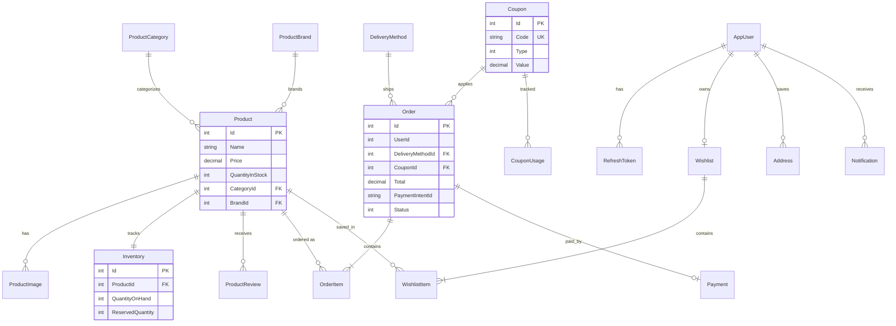

# Database

Natures Chakki uses **SQL Server** with two EF Core DbContexts sharing one database (`NaturesChakki`).

## Contexts

| Context | File | Migrations folder |
|---------|------|-------------------|
| Commerce | `Infrastructure/Data/StoreContext.cs` | `Infrastructure/Migrations/Store/` |
| Identity | `Infrastructure/Data/AppIdentityDbContext.cs` | `Infrastructure/Migrations/Identity/` |

Connection string key: `ConnectionStrings:DefaultConnection`

## Commerce Schema (`StoreContext`)

### Entities

| Entity | Table | Description |
|--------|-------|-------------|
| `Product` | Products | Catalog items with price, stock, brand/type |
| `ProductCategory` | ProductCategories | Category taxonomy |
| `ProductBrand` | ProductBrands | Brand taxonomy |
| `ProductImage` | ProductImages | Additional product images |
| `Inventory` | Inventories | On-hand and reserved stock per product |
| `Order` | Orders | Customer orders with owned `ShipToAddress` |
| `OrderItem` | OrderItems | Line items |
| `Payment` | Payments | Stripe payment records |
| `Coupon` | Coupons | Discount codes |
| `CouponUsage` | CouponUsages | Per-user coupon redemption tracking |
| `ProductReview` | ProductReviews | Customer reviews (moderation status) |
| `Wishlist` | Wishlists | One wishlist per user |
| `WishlistItem` | WishlistItems | Wishlist line items |
| `DeliveryMethod` | DeliveryMethods | Shipping options |
| `Address` | Addresses | Saved user addresses |
| `Notification` | Notifications | In-app notifications |
| `AuditLog` | AuditLogs | Admin audit trail |

### Relationships

- `Product` → `ProductCategory`, `ProductBrand` (FK: `CategoryId`, `BrandId`)
- `Product` → `ProductImage` (1:N)
- `Product` → `Inventory` (1:1)
- `Product` → `ProductReview` (1:N)
- `Order` → `OrderItem` (1:N)
- `Order` → `DeliveryMethod` (N:1)
- `Order` → `Coupon` (optional N:1)
- `Order.ShipToAddress` — owned entity (`OwnsOne` in `StoreContext`)
- `Wishlist` → `WishlistItem` (1:N), one wishlist per `UserId`

Identity tables (`AspNetUsers`, `AspNetRoles`, etc.) live in `AppIdentityDbContext` with `AppUser` (`IdentityUser<int>`) and `RefreshToken`.
`EmailVerificationOtps` stores one hashed, expiring OTP record per unverified user.

## Indexes

Configured in `Infrastructure/Config/EntityConfigurations.cs`:

| Table | Index | Type |
|-------|-------|------|
| ProductCategories | Name | Unique |
| ProductBrands | Name | Unique |
| Coupons | Code | Unique |
| Payments | PaymentIntentId | Unique |
| Inventories | ProductId | Unique |
| Wishlists | UserId | Unique |
| RefreshTokens | Token | Unique |

## Decimal Precision

Money columns use `decimal(18,2)` for `Order`, `OrderItem`, `Payment`, `Coupon`, `DeliveryMethod`.

## Cart Storage

Shopping carts are **not** persisted in SQL. They use `ICartService`:

- `InMemoryCartStorage` when `CacheProvider=Memory`
- `RedisCartStorage` when `CacheProvider=Redis`

Cart entities (`ShoppingCart`, `CartItem`) are serialized JSON documents keyed by cart ID.

## ER Diagram



## Seeding

- **Commerce**: `Infrastructure/Data/StoreContextSeed.cs` — products, brands, categories, delivery methods from `Infrastructure/Data/SeedData/`
- **Identity**: `Infrastructure/Data/IdentitySeed.cs` — Admin and Customer roles + dev users (Development only)

## Migration Commands Reference

```bash
# List migrations
dotnet ef migrations list --project Infrastructure --startup-project API --context StoreContext

# Roll back
dotnet ef database update <PreviousMigration> --project Infrastructure --startup-project API --context StoreContext
```

## Database Portability Assessment

No provider migration has been performed.

### SQL Server → PostgreSQL: High

The application primarily uses portable EF Core LINQ, relationships, repositories, owned entities, and EF transactions. No raw SQL, stored procedures, rowversion, or SQL Server-only query features were found.

Later work:

- Replace `UseSqlServer`/SQL Server package with Npgsql configuration.
- Regenerate both migration histories for PostgreSQL; current migrations and explicit `decimal(18,2)` store types are SQL Server-oriented.
- Validate identifier casing, string comparison/collation behavior, date/time mappings, transaction isolation, Identity schema, and concurrency under PostgreSQL.
- Run the full integration suite against a real PostgreSQL instance rather than EF InMemory.

### SQL Server → Cosmos DB: Low

Cosmos DB is not a relational drop-in replacement. Main blockers are ASP.NET Identity's relational stores, two relational DbContexts sharing one database, joins/`Include`, foreign keys, unique constraints, owned address mapping, multi-entity checkout transactions, and the normalized order/product/inventory model.

Later work would require aggregate/document redesign, explicit partition keys, denormalization, optimistic concurrency, idempotent inventory/order workflows instead of cross-partition relational transactions, Cosmos-specific repositories/migrations, and likely retaining Identity in a separate relational database.
