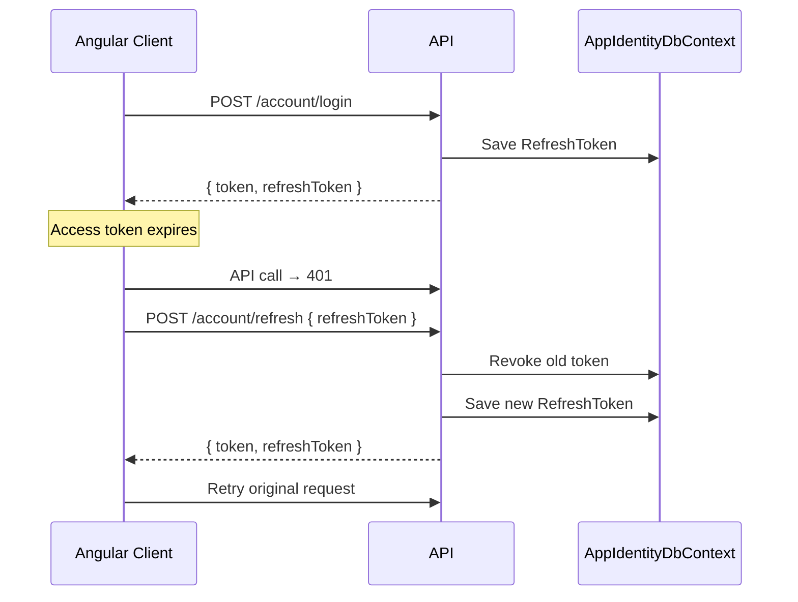

# Authentication

Natures Chakki uses **ASP.NET Core Identity** for user management and **JWT Bearer tokens** for API authentication, with **refresh tokens** stored in SQL Server.

## Identity Setup

Configured in `Infrastructure/InfrastructureServiceRegistration.cs`:

- `AppUser` extends `IdentityUser<int>` with `DisplayName` and `CreatedAt`
- New registrations remain unverified until email OTP confirmation
- `AppRole` extends `IdentityRole<int>`
- DbContext: `AppIdentityDbContext`
- Password policy: digit, upper, lower required; min length 6

### Roles

| Role | Purpose |
|------|---------|
| `Customer` | Default role on registration; shop, orders, wishlist |
| `Admin` | Product/order management, coupon CRUD, review moderation |

## JWT Configuration

Keys in `API/appsettings.json` under `JwtSettings`:

| Key | Description |
|-----|-------------|
| `JwtSettings:Key` | Symmetric signing key (min 32 chars) |
| `JwtSettings:Issuer` | Token issuer (e.g. `https://localhost:5001`) |
| `JwtSettings:Audience` | Token audience |
| `JwtSettings:DurationInMinutes` | Access token lifetime (default: 60) |

JWT is configured in `API/Program.cs` with `AddAuthentication(JwtBearerDefaults.AuthenticationScheme)`.

Claims issued by `TokenService.CreateToken`:

- `ClaimTypes.Email`
- `ClaimTypes.NameIdentifier` (user ID)
- `ClaimTypes.Name` (display name)
- `ClaimTypes.Role` (one per role)

SignalR hub `/hubs/order` accepts JWT via query string `access_token` (see `OnMessageReceived` in `Program.cs`).

## Refresh Tokens

Stored in `RefreshTokens` table (`AppIdentityDbContext`).

| Field | Description |
|-------|-------------|
| `Token` | Base64 random string (64 bytes) |
| `UserId` | FK to `AppUser` |
| `ExpiresAt` | Default 7 days from issuance |
| `IsRevoked` | Set on refresh or logout |

### Endpoints (`AccountController`)

| Method | Route | Auth | Behavior |
|--------|-------|------|----------|
| POST | `/api/v1/account/register` | Anonymous | Creates an unverified user and sends an OTP |
| POST | `/api/v1/account/verify-email` | Anonymous | Verifies OTP, activates account, returns JWT + refresh |
| POST | `/api/v1/account/resend-verification` | Anonymous | Invalidates prior OTP and sends a replacement subject to cooldown |
| POST | `/api/v1/account/login` | Anonymous | Validates credentials, returns JWT + refresh |
| GET | `/api/v1/account/current` | Bearer | Returns current user DTO |
| POST | `/api/v1/account/refresh` | Anonymous | Revokes old refresh token, issues new pair |
| POST | `/api/v1/account/logout` | Bearer | Revokes all active refresh tokens for user |

### Refresh Flow

## Frontend Integration

- `client/src/app/core/services/auth.service.ts` — login, register, token storage
- Application initialization validates the persisted access/refresh session against `/account/current`
- `client/src/app/core/interceptors/auth-interceptor.ts` — attaches `Authorization: Bearer`, handles 401 with silent refresh
- `client/src/app/core/guards/auth.guard.ts` — protects checkout and account routes
- `client/src/app/core/guards/admin.guard.ts` — protects `/admin` routes

## Development Users

Seeded in Development via `IdentitySeed` (`SeedUsers` config):

| Email | Password | Role |
|-------|----------|------|
| admin@natureschakki.com | Admin@123! | Admin |
| customer@natureschakki.com | Customer@123! | Customer |

## Swagger

Use the **Authorize** button and enter: `Bearer <your-jwt-token>`

## Production Notes

- Store `JwtSettings:Key` in Azure Key Vault or environment variables — never commit production keys
- Use short access token lifetime (15–60 min) with refresh token rotation (already implemented)
- Enable HTTPS only; set `JwtSettings:Issuer` and `Audience` to production API URL

## Email OTP Verification

- OTPs are generated with `RandomNumberGenerator`, then stored only as an ASP.NET Identity password hash.
- Default validity is 10 minutes, maximum failed attempts is 5, and resend cooldown is 60 seconds.
- Resending replaces the previous hash, immediately invalidating the previous code.
- Login is denied until `EmailConfirmed` is true.
- `IEmailService` isolates registration from the configured provider. `SmtpEmailService` supports Gmail SMTP now; future providers only need a new implementation and DI selection.
- SMTP credentials are configuration/environment values (`Email__Smtp__Username`, `Email__Smtp__Password`) and must not be committed.
