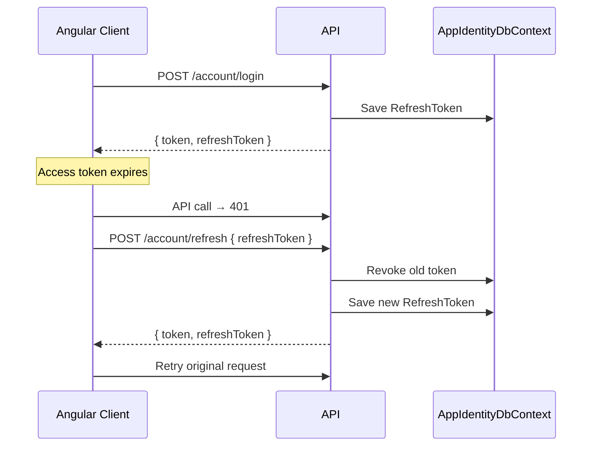

# Authentication

Natures Chakki uses **ASP.NET Core Identity** for user management and **JWT Bearer tokens** for API authentication, with **refresh tokens** stored in SQL Server.

## Identity Setup

Configured in `Infrastructure/InfrastructureServiceRegistration.cs`:

- `AppUser` extends `IdentityUser<int>` with `DisplayName` and `CreatedAt`
- New registrations remain unverified until email OTP confirmation
- `AppRole` extends `IdentityRole<int>`
- DbContext: `AppIdentityDbContext`
- Password policy: digit, upper, lower required; minimum length 8

### Roles

| Role | Purpose |
|------|---------|
| `Customer` | Default role on registration; shop, orders, wishlist |
| `Admin` | Product/order management, coupon CRUD, review moderation |

## JWT Configuration

Keys in `API/appsettings.json` under `JwtSettings`:

| Key | Description |
|-----|-------------|
| `JwtSettings:Key` | Symmetric signing key (min 32 chars) |
| `JwtSettings:Issuer` | Token issuer (e.g. `https://localhost:5001`) |
| `JwtSettings:Audience` | Token audience |
| `JwtSettings:DurationInMinutes` | Access token lifetime (default: 60) |

JWT is configured in `API/Program.cs` with `AddAuthentication(JwtBearerDefaults.AuthenticationScheme)`.

Claims issued by `TokenService.CreateToken`:

- `ClaimTypes.Email`
- `ClaimTypes.NameIdentifier` (user ID)
- `ClaimTypes.Name` (display name)
- `ClaimTypes.Role` (one per role)

## Refresh Tokens

Stored in `RefreshTokens` table (`AppIdentityDbContext`).

| Field | Description |
|-------|-------------|
| `Token` | Opaque cryptographically random Base64 value (stored server-side for rotation/revocation) |
| `UserId` | FK to `AppUser` |
| `ExpiresAt` | Default 7 days from issuance |
| `IsRevoked` | Set on refresh or logout |

### Endpoints (`AccountController`)

| Method | Route | Auth | Behavior |
|--------|-------|------|----------|
| POST | `/api/v1/account/register` | Anonymous | Creates an unverified user and sends an OTP |
| POST | `/api/v1/account/verify-email` | Anonymous | Verifies OTP, activates account, returns JWT + refresh |
| POST | `/api/v1/account/resend-verification` | Anonymous | Invalidates prior OTP and sends a replacement subject to cooldown |
| POST | `/api/v1/account/login` | Anonymous | Validates credentials, returns JWT + refresh |
| GET | `/api/v1/account/current` or `/current-user` | Bearer | Returns current user DTO |
| POST | `/api/v1/account/refresh` or `/refresh-token` | Anonymous | Revokes old refresh token, issues new pair |
| POST | `/api/v1/account/logout` | Bearer | Revokes all active refresh tokens for user |
| POST | `/api/v1/account/forgot-password` | Anonymous, rate limited | Always returns the same response and emails a short-lived opaque reset link |
| POST | `/api/v1/account/reset-password` | Anonymous, rate limited | Consumes a single-use hashed reset token |

### Refresh Flow

```mermaid
sequenceDiagram
    participant C as Angular Client
    participant A as API
    participant DB as AppIdentityDbContext

    C->>A: POST /account/login
    A->>DB: Save RefreshToken
    A-->>C: { token, refreshToken }

    Note over C: Access token expires
    C->>A: API call → 401
    C->>A: POST /account/refresh { refreshToken }
    A->>DB: Revoke old token
    A->>DB: Save new RefreshToken
    A-->>C: { token, refreshToken }
    C->>A: Retry original request
```

## Frontend Integration

- `client/src/app/core/services/auth.service.ts` is the single reactive authentication state
- Application initialization validates persisted access/refresh state against `/account/current-user`; invalid sessions clear state and header/account UI
- `client/src/app/core/interceptors/auth-interceptor.ts` — attaches `Authorization: Bearer`, handles 401 with silent refresh
- `client/src/app/core/guards/auth.guard.ts` — protects checkout and account routes
- `client/src/app/core/guards/admin.guard.ts` — protects `/admin` routes
- Successful Admin login redirects directly to `/admin`; customer login merges the guest cart and redirects to `/shop` or the requested route

## Development Users

Optional development users are seeded only when `SeedUsers:Enabled=true`. Email addresses and passwords must be supplied through User Secrets or environment variables; no default credentials are committed.

## Swagger

Development Swagger UI is available at `/swagger`. Use **Authorize** with `Bearer <token>`. Production Swagger is disabled by default and can be enabled temporarily with `Swagger:Enabled=true` for APIM import.

## Production Notes

- Store `JwtSettings:Key` in Azure Key Vault or environment variables — never commit production keys
- Use short access token lifetime (15–60 min) with refresh token rotation (already implemented)
- Enable HTTPS only; set `JwtSettings:Issuer` and `Audience` to production API URL

## Email OTP Verification

- OTPs are generated with `RandomNumberGenerator`, then stored only as an ASP.NET Identity password hash.
- Default validity is 10 minutes, maximum failed attempts is 5, and resend cooldown is 60 seconds.
- Resending replaces the previous hash, immediately invalidating the previous code.
- Login is denied until `EmailConfirmed` is true.
- `IEmailService` isolates registration from the configured provider. `SmtpEmailService` supports Gmail SMTP now; future providers only need a new implementation and DI selection.
- SMTP credentials are configuration/environment values (`Email__Smtp__Username`, `Email__Smtp__Password`) and must not be committed.
- Local development should use .NET User Secrets under the `API` project. `Email:Smtp:Password` must be a Gmail App Password, not the normal Gmail password.
- Development generates an ephemeral JWT key when none is configured; use `JwtSettings:Key` in User Secrets to keep sessions valid across API restarts. Production requires an explicit key.

## Password reset

Reset links contain only an opaque token. The server stores its SHA-256 hash in `PasswordResetTokens`, expires it after `PasswordReset:ExpiryMinutes` (default 30), revokes older unused tokens when a new link is requested, and marks a token used after a successful reset. Responses do not reveal whether an email exists, and logs record the user id without the token, password, or reset URL. Production requires an HTTPS `ClientUrl`. The forgot/reset endpoints allow 5 requests per 15 minutes per IP.
