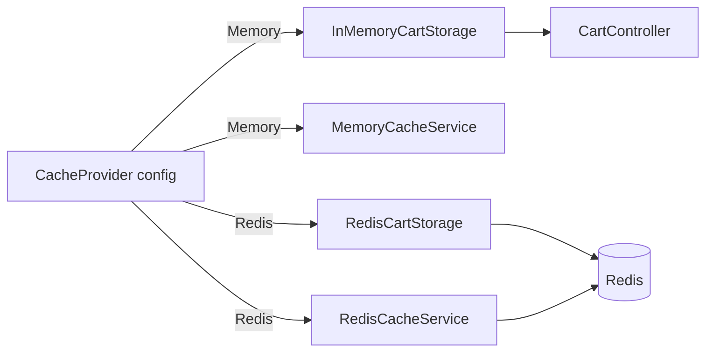

# Caching

Natures Chakki uses a pluggable cache strategy controlled by the `CacheProvider` configuration key.

## Configuration

```json
{
  "CacheProvider": "Memory",
  "ConnectionStrings": {
    "Redis": "localhost:6379"
  }
}
```

Set in `API/appsettings.json`, `API/appsettings.Development.json`, or environment variable `CacheProvider`.

Registration logic: `Infrastructure/InfrastructureServiceRegistration.cs`

## Providers

| `CacheProvider` | `ICartService` | `ICacheService` | Registration |
|-----------------|----------------|-----------------|--------------|
| `Memory` (default) | `InMemoryCartStorage` | `MemoryCacheService` | `AddMemoryCache()` |
| `Redis` | `RedisCartStorage` | `RedisCacheService` | `IConnectionMultiplexer` via `ConnectionStrings:Redis` |

## ICartService

Interface: `Core/Interfaces/ICartService.cs`

| Method | Description |
|--------|-------------|
| `GetCartAsync(key)` | Retrieve cart by anonymous or session ID |
| `SetCartAsync(cart)` | Persist cart |
| `DeleteCartAsync(key)` | Remove cart |

### InMemoryCartStorage

- Static `ConcurrentDictionary<string, string>` in `Infrastructure/Services/InMemoryCartStorage.cs`
- JSON-serialized `ShoppingCart` objects
- **Dev/single-instance only** — data lost on restart, not shared across instances

### RedisCartStorage

- `Infrastructure/Services/RedisCartStorage.cs`
- Uses StackExchange.Redis `IDatabase`
- Keys prefixed for cart isolation
- **Required for production** multi-instance deployments

Cart API: `API/Controllers/CartController.cs` — `GET/POST/DELETE /api/v1/cart?id={cartId}`

## ICacheService

Interface: `Core/Interfaces/ICacheService.cs`

Used for general-purpose caching (product lookups, etc.):

- `MemoryCacheService` — wraps `IMemoryCache`
- `RedisCacheService` — distributed cache via Redis

## Switching to Redis Locally

1. Start Redis: `docker compose up -d redis`
2. Update `appsettings.Development.json`:

```json
{
  "CacheProvider": "Redis",
  "ConnectionStrings": {
    "Redis": "localhost:6379"
  }
}
```

3. Restart the API

## Architecture



## Production Recommendations

| Concern | Recommendation |
|---------|----------------|
| Cart persistence | Set `CacheProvider=Redis` |
| Connection string | Use Azure Cache for Redis with SSL (`rediss://`) |
| TTL | Add expiration on cart keys (e.g. 7–30 days) for abandoned carts |
| Failover | Configure Redis connection multiplexer with retry and timeout |
| Secrets | Store `ConnectionStrings__Redis` in Key Vault |
| Monitoring | Track Redis memory, hit rate, and connection errors |
| Scale-out | Never use `Memory` provider when running multiple API instances |

## Health Checks

`Program.cs` registers EF Core health checks for both DbContexts at `/health`. Consider adding a Redis health check when using the Redis provider in production.
