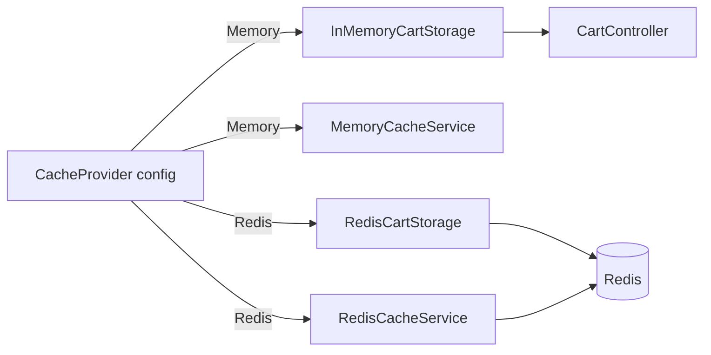

# Caching

Natures Chakki uses a pluggable cache strategy controlled by the `CacheProvider` configuration key.

## Configuration

```json
{
  "CacheProvider": "Memory",
  "ConnectionStrings": {
    "Redis": "localhost:6379"
  }
}
```

Set in `API/appsettings.json`, `API/appsettings.Development.json`, or environment variable `CacheProvider`.

Registration logic: `Infrastructure/InfrastructureServiceRegistration.cs`

## Providers

| `CacheProvider` | `ICartService` | `ICacheService` | Registration |
|-----------------|----------------|-----------------|--------------|
| `Memory` (default) | `InMemoryCartStorage` | `MemoryCacheService` | `AddMemoryCache()` |
| `Redis` | `RedisCartStorage` | `RedisCacheService` | `IConnectionMultiplexer` via `ConnectionStrings:Redis` |

## ICartService

Interface: `Core/Interfaces/ICartService.cs`

`ICartService` is the storage abstraction. Controllers use `CartWorkflow`, which enforces ownership, trusted product prices, active/stock checks, configurable kg increments, duplicate merging and per-cart concurrency locks before writing storage.

| Method | Description |
|--------|-------------|
| `GetCartAsync(key)` | Retrieve cart by anonymous or session ID |
| `SetCartAsync(cart)` | Persist cart |
| `DeleteCartAsync(key)` | Remove cart |

### InMemoryCartStorage

- Static `ConcurrentDictionary<string, string>` in `Infrastructure/Services/InMemoryCartStorage.cs`
- JSON-serialized `ShoppingCart` objects
- **Affordable single-instance default** — data is lost on restart/deployment and is not shared across instances

### RedisCartStorage

- `Infrastructure/Services/RedisCartStorage.cs`
- Uses StackExchange.Redis `IDatabase`
- 30-day key expiry
- Optional for restart persistence and multi-instance deployment

Cart API:

| Endpoint | Behavior |
|----------|----------|
| `GET /api/v1/cart?id=` | Read own authenticated cart or a non-user guest cart |
| `POST /api/v1/cart` | Backward-compatible normalized replace; authenticated id comes from claims |
| `POST /api/v1/cart/items` | Authenticated add/set quantity in kg |
| `DELETE /api/v1/cart/items/{productId}` | Authenticated item removal |
| `DELETE /api/v1/cart?id=` | Clear own/guest cart subject to ownership rules |

## ICacheService

Interface: `Core/Interfaces/ICacheService.cs`

Used for general-purpose caching (product lookups, etc.):

- `MemoryCacheService` — wraps `IMemoryCache`
- `RedisCacheService` — distributed cache via Redis

## Switching to Redis Locally

1. Start Redis: `docker compose up -d redis`
2. Update `appsettings.Development.json`:

```json
{
  "CacheProvider": "Redis",
  "ConnectionStrings": {
    "Redis": "localhost:6379"
  }
}
```

3. Restart the API

## Architecture


```mermaid
flowchart LR
    CFG[CacheProvider config]
    CFG -->|Memory| MEM[InMemoryCartStorage]
    CFG -->|Memory| MC[MemoryCacheService]
    CFG -->|Redis| RC[RedisCartStorage]
    CFG -->|Redis| RS[RedisCacheService]
    MEM --> API[CartController]
    RC --> REDIS[(Redis)]
    RS --> REDIS
```

## Production Recommendations

| Concern | Recommendation |
|---------|----------------|
| Affordable single App Service default | `CacheProvider=Memory` |
| Cart persistence through restart/scale | Upgrade to `CacheProvider=Redis` |
| Connection string | Use Azure Cache for Redis with SSL (`rediss://`) |
| TTL | Add expiration on cart keys (e.g. 7–30 days) for abandoned carts |
| Failover | Configure Redis connection multiplexer with retry and timeout |
| Secrets | Store `ConnectionStrings__Redis` in Key Vault |
| Monitoring | Track Redis memory, hit rate, and connection errors |
| Scale-out | Use Redis before enabling multiple App Service instances |

## Health Checks

`Program.cs` registers EF Core health checks for both DbContexts at `/health`. Redis is not selected or health-checked by the affordable default; add a Redis health check when adopting that provider.
