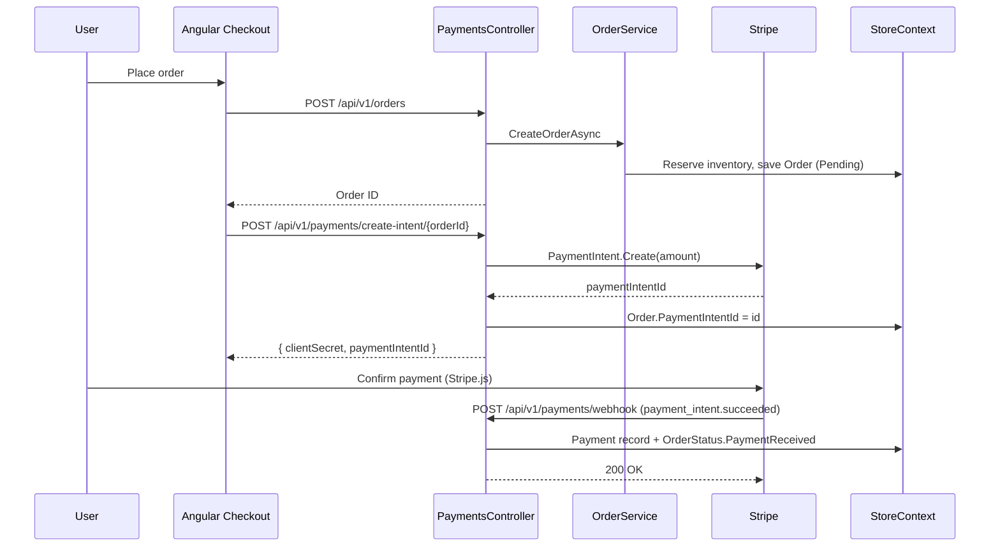

# Payments

Payments are processed through **Stripe Payment Intents** with webhook confirmation and idempotent order status updates.

## Components

| File | Role |
|------|------|
| `Infrastructure/Services/StripePaymentService.cs` | Creates payment intents and refunds |
| `API/Controllers/PaymentsController.cs` | Intent creation + webhook endpoint |
| `Core/Interfaces/IPaymentService.cs` | Payment abstraction |

## Configuration

`API/appsettings.json` → `StripeSettings`:

| Key | Description |
|-----|-------------|
| `StripeSettings:PublishableKey` | Frontend Stripe.js key |
| `StripeSettings:SecretKey` | Server-side API key |
| `StripeSettings:WebhookSecret` | Webhook signing secret (`whsec_...`) |

When `SecretKey` is empty or `sk_test_placeholder`, the API runs in **mock mode** and returns `pi_mock_{guid}` intents.

## Payment Flow



## API Endpoints

| Method | Route | Auth | Description |
|--------|-------|------|-------------|
| POST | `/api/v1/payments/create-intent/{orderId}` | Bearer | Creates Stripe intent for order total |
| POST | `/api/v1/payments/webhook` | Anonymous | Stripe event handler |

## Webhook Handling

`PaymentsController.Webhook`:

1. Reads raw request body
2. Validates signature with `EventUtility.ConstructEvent` and `StripeSettings:WebhookSecret`
3. On `payment_intent.succeeded`:
   - Finds order by `PaymentIntentId`
   - Calls `orderService.UpdateOrderStatusAsync(orderId, OrderStatus.PaymentReceived)`
   - Inserts `Payment` record with `PaymentStatus.Succeeded`

Mock mode: if webhook secret is `whsec_placeholder`, returns `200 OK` without processing.

## Idempotency

| Mechanism | Implementation |
|-----------|----------------|
| Unique payment intent | `Payments.PaymentIntentId` has unique index (`EntityConfigurations.cs`) |
| Order lookup | Webhook finds order by `PaymentIntentId` — duplicate events update same order |
| Status guard | `OrderService.UpdateOrderStatusAsync` validates transitions before updating |
| Mock intents | Prefixed `pi_mock_` for local dev without Stripe |

**Recommendation for production:** use Stripe idempotency keys on `PaymentIntent.Create` and check `Payment` table before inserting duplicate webhook records.

## Refunds

`StripePaymentService.RefundPaymentAsync` — creates Stripe refund; mock intents return `true` immediately.

## Local Webhook Testing

```bash
stripe listen --forward-to https://localhost:5001/api/v1/payments/webhook
# Copy whsec_... to StripeSettings:WebhookSecret
```

## Order Status Lifecycle

Relevant statuses (`Core/Enums/OrderStatus.cs`):

`Pending` → `PaymentReceived` → `Processing` → `Shipped` → `Delivered`

Cancellation releases reserved inventory via `InventoryService`.

## Security

- Webhook endpoint is `[AllowAnonymous]` but **must** validate Stripe signature in production
- Never expose `SecretKey` or `WebhookSecret` to the frontend
- Use `PublishableKey` only in Angular for Stripe Elements
