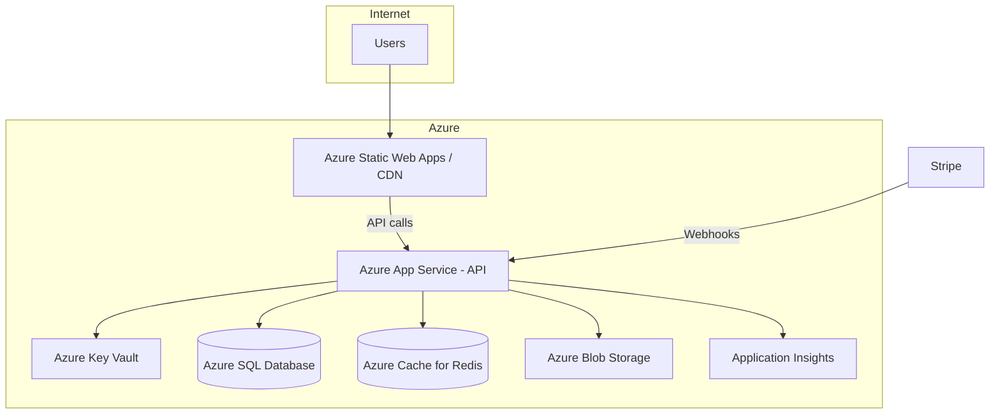

# Deployment

## Docker

### Multi-Stage API Dockerfile

Root `Dockerfile` builds and publishes the API:

```bash
docker build -t natureschakki-api .
docker run -p 8080:8080 \
  -e ConnectionStrings__DefaultConnection="Server=sql,1433;..." \
  -e ASPNETCORE_ENVIRONMENT=Production \
  natureschakki-api
```

### Docker Compose (Full Stack)

`docker-compose.yml` includes SQL Server, Redis, and the API service:

```bash
docker compose up -d
```

| Service | Port | Image |
|---------|------|-------|
| sql | 1433 | `mcr.microsoft.com/mssql/server:2022-latest` |
| redis | 6379 | `redis:7-alpine` |
| api | 8080 | Built from `Dockerfile` |

API waits for SQL and Redis health checks before starting.

### Frontend

Build static assets and serve via CDN or nginx:

```bash
cd client
npm run build
# Output: client/dist/client/browser/
```

Point `environment.prod.ts` `apiUrl` to the production API.

## Azure Architecture



| Service | Purpose |
|---------|---------|
| **App Service** | Host ASP.NET Core API (`linux`, .NET 9) |
| **Azure SQL** | `StoreContext` + `AppIdentityDbContext` |
| **Azure Cache for Redis** | Cart + distributed cache (`CacheProvider=Redis`) |
| **Key Vault** | JWT key, Stripe secrets, connection strings |
| **Blob Storage** | Product images (`IFileStorageService` / `LocalFileStorage` → migrate to blob) |
| **Application Insights** | Serilog + request telemetry |

## Environment Variables

Use double-underscore notation for nested config in App Service / containers:

| Variable | Maps to | Required |
|----------|---------|----------|
| `ASPNETCORE_ENVIRONMENT` | — | Yes (`Production`) |
| `ConnectionStrings__DefaultConnection` | SQL connection | Yes |
| `ConnectionStrings__Redis` | Redis connection | If `CacheProvider=Redis` |
| `CacheProvider` | `Memory` or `Redis` | Yes (use `Redis` in prod) |
| `JwtSettings__Key` | Signing key | Yes |
| `JwtSettings__Issuer` | Token issuer | Yes |
| `JwtSettings__Audience` | Token audience | Yes |
| `JwtSettings__DurationInMinutes` | Access token TTL | Optional (60) |
| `StripeSettings__SecretKey` | Stripe API key | Yes |
| `StripeSettings__PublishableKey` | Stripe public key | Yes (frontend) |
| `StripeSettings__WebhookSecret` | Webhook signing | Yes |
| `SeedUsers__AdminEmail` | Dev seed only | No (omit in prod) |
| `SeedUsers__AdminPassword` | Dev seed only | No (omit in prod) |

See `.env.example` for a local template.

## Azure App Service Setup

1. Create App Service (Linux, .NET 9)
2. Enable **Managed Identity** → grant Key Vault access
3. Configure Application Settings from Key Vault references
4. Set `CacheProvider=Redis` and Redis connection string
5. Configure custom domain + TLS
6. Add Stripe webhook URL: `https://<api-domain>/api/v1/payments/webhook`

## Database Migrations in Production

Run migrations as a deployment step (not on every instance startup in multi-instance):

```bash
dotnet ef database update --project Infrastructure --startup-project API --context StoreContext
dotnet ef database update --project Infrastructure --startup-project API --context AppIdentityDbContext
```

Or use an App Service deployment slot / GitHub Action step before swap.

## CI/CD

`azure-pipelines.yml` provides Build → Test → Publish stages. Connect to Azure DevOps and configure:

- Service connection to Azure
- App Service deployment task in Publish stage
- Variable group for secrets

## Health & Monitoring

- Liveness: `GET /health` (EF Core DbContext checks)
- Logs: Serilog to console → App Service log stream / Application Insights
- Alerts: 5xx rate, SQL connection failures, Redis timeouts

## CORS (Production)

Update `API/Program.cs` CORS origins to production frontend URL:

```csharp
.WithOrigins("https://www.natureschakki.com")
```

## Security Checklist

- [ ] HTTPS enforced (App Service + HSTS)
- [ ] Secrets in Key Vault, not appsettings
- [ ] `SeedUsers` disabled in Production
- [ ] Redis SSL enabled
- [ ] Stripe webhook signature validation active
- [ ] Rate limiting configured (100 req/min per user/host)
