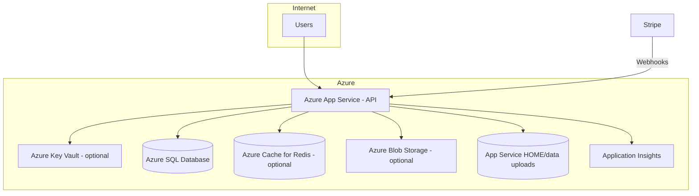

# Deployment

> The supported production topology is now one Azure App Service serving both Angular and the .NET 10 API. See [12-Azure-Single-App-Service.md](./12-Azure-Single-App-Service.md) for the authoritative manual deployment procedure. The legacy Azure DevOps pipeline is not part of this deployment process.

## Docker

### Multi-Stage API Dockerfile

Root `Dockerfile` builds and publishes the API:

```bash
docker build -t natureschakki-api .
docker run -p 8080:8080 \
  -e ConnectionStrings__DefaultConnection="Server=sql,1433;..." \
  -e ASPNETCORE_ENVIRONMENT=Production \
  natureschakki-api
```

### Docker Compose (Full Stack)

`docker-compose.yml` includes SQL Server, Redis, and the API service:

```bash
docker compose up -d
```

| Service | Port | Image |
|---------|------|-------|
| sql | 1433 | `mcr.microsoft.com/mssql/server:2022-latest` |
| redis | 6379 | `redis:7-alpine` |
| api | 8080 | Built from `Dockerfile` |

API waits for SQL and Redis health checks before starting.

### Frontend

Angular is built during `dotnet publish` and included in the API publish output under `wwwroot`. Production uses the same-origin API URL `/api`; a separate frontend host is not required.

## Azure Architecture


```mermaid
flowchart TB
    subgraph Internet
        USER[Users]
    end

    subgraph Azure
        APP[Azure App Service - API]
        KV[Azure Key Vault - optional]
        SQL[(Azure SQL Database)]
        REDIS[(Azure Cache for Redis - optional)]
        BLOB[Azure Blob Storage - optional]
        LOCAL[(App Service HOME/data uploads)]
        INS[Application Insights]
    end

    STRIPE[Stripe]

    USER --> APP
    APP --> KV
    APP --> SQL
    APP --> LOCAL
    APP --> REDIS
    APP --> BLOB
    APP --> INS
    STRIPE -->|Webhooks| APP
```

| Service | Purpose |
|---------|---------|
| **App Service** | Host ASP.NET Core .NET 10 API and Angular static application |
| **Azure SQL** | `StoreContext` + `AppIdentityDbContext` |
| **App Service persistent HOME** | Default product image storage for the single App Service |
| **Azure Cache for Redis** | Optional cart persistence/scale-out (`CacheProvider=Redis`) |
| **Key Vault** | JWT key, Stripe secrets, connection strings |
| **Blob Storage** | Optional product image provider (`FileStorage:Provider=AzureBlob`) |
| **Application Insights** | Serilog + request telemetry |

## Environment Variables

Use double-underscore notation for nested config in App Service / containers:

| Variable | Maps to | Required |
|----------|---------|----------|
| `ASPNETCORE_ENVIRONMENT` | — | Yes (`Production`) |
| `ConnectionStrings__DefaultConnection` | SQL connection | Yes |
| `ConnectionStrings__Redis` | Redis connection | If `CacheProvider=Redis` |
| `CacheProvider` | `Memory` default; `Redis` optional for scale/restart persistence | Yes |
| `JwtSettings__Key` | Signing key | Yes |
| `JwtSettings__Issuer` | Token issuer | Yes |
| `JwtSettings__Audience` | Token audience | Yes |
| `JwtSettings__DurationInMinutes` | Access token TTL | Optional (60) |
| `ClientUrl` | Same App Service public HTTPS URL | Yes |
| `StripeSettings__SecretKey` | Stripe API key | Only when enabling future online payments |
| `StripeSettings__WebhookSecret` | Stripe webhook signing | Only when enabling future online payments |
| `Email__Provider` | Email provider (`Smtp`) | Yes |
| `Email__FromAddress` | Verified sender address | Yes |
| `Email__Smtp__Host` / `Email__Smtp__Port` | SMTP endpoint | Yes |
| `Email__Smtp__Username` / `Email__Smtp__Password` | SMTP credentials (Key Vault) | Yes |
| `FileStorage__Provider` | `Local` default using App Service persistent home; `AzureBlob` optional | Yes |
| `FileStorage__LocalPath` | Local upload root | Optional; defaults to `%HOME%/data/NaturesChakki/uploads` |
| `Database__ApplyMigrationsOnStartup` | Startup schema changes | Must remain `false` in Production |
| `Database__SeedStoreDataOnStartup` | One-time catalog seed | Enable once only when needed |
| `Database__SeedIdentityRolesOnStartup` | Idempotent Admin/Customer role seed | Enable after schema exists |
| `SeedUsers__Enabled` | Optional user bootstrap | `false`, except first Admin bootstrap |
| `SeedUsers__AdminEmail` / `SeedUsers__AdminPassword` | One-time Production Admin bootstrap | Only while `SeedUsers__Enabled=true`; remove password afterward |
| `Swagger__Enabled` | Runtime Swagger endpoint for temporary APIM import | Optional; default `false` |

See `.env.example` for a local template.

## Azure App Service Setup

1. Create one App Service with the .NET 10 runtime
2. Enable **Managed Identity** when using passwordless Azure SQL/Key Vault
3. Configure Application Settings or Key Vault references
4. Keep `CacheProvider=Memory` initially, or configure Redis when cart persistence/scale-out is required
5. Configure custom domain + TLS
6. Add Stripe webhook URL: `https://<api-domain>/api/v1/payments/webhook`

## Database Migrations in Production

Run migrations as a deployment step, not during production startup:

```bash
./scripts/deploy-database.ps1
```

Or generate idempotent scripts with `scripts/generate-database-scripts.ps1`, review them, then execute Store first and Identity second.

## Manual publish

`scripts/publish-single-app.ps1` restores, builds, tests and publishes Angular + .NET into one output. Deploy the resulting ZIP manually with Visual Studio Web Deploy or `az webapp deploy`. The old two-service Azure DevOps pipeline is archived under `docs/legacy` and must not be enabled.

## Health & Monitoring

- Liveness: `GET /health` (EF Core DbContext checks)
- Logs: Serilog to console → App Service log stream / Application Insights
- Alerts: 5xx rate and SQL connection failures; add Redis/Blob telemetry when those optional providers are selected

## CORS (Production)

Production Angular and API are same-origin, so normal browser calls require no CORS origin. `Cors:AllowedOrigins` is configuration-driven for an intentionally separate trusted client; Development lists localhost only.

## Security Checklist

- [ ] HTTPS enforced (App Service + HSTS)
- [ ] Secrets in Key Vault, not appsettings
- [ ] `SeedUsers` disabled in Production
- [ ] Redis SSL enabled if Redis is selected
- [ ] Stripe webhook signature validation active before enabling online payments
- [ ] Rate limiting configured (100 req/min per user/host)
