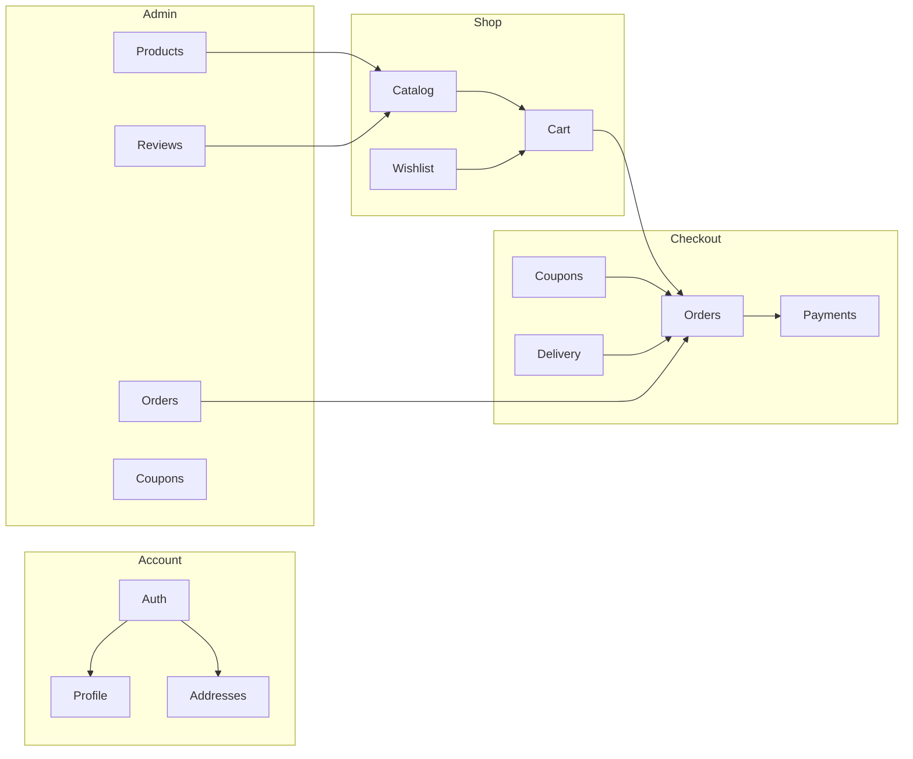

# Feature Documentation

End-to-end feature reference for the Natures Chakki e-commerce platform.

## Catalog

**Backend:** `ProductController` (`/api/product`), `SqlProductSearchService`

| Capability | Endpoint | Notes |
|------------|----------|-------|
| List products (paginated) | `GET /api/product?pageIndex=&pageSize=` | Filter by brand, type, sort |
| Product detail | `GET /api/product/{id}` | Includes images, reviews |
| Brands filter | `GET /api/product/brands` | Distinct brand names |
| Types filter | `GET /api/product/types` | Distinct product types |
| Admin CRUD | `/api/v1/admin/products` | Admin role required |

**Frontend:** `client/src/app/features/shop/`

- `shop.component.ts` — product grid with filters
- `product-details.component.ts` — detail page with add-to-cart
- `product-item.component.ts` — card component

**Specification pattern:** `ProductSpecification`, `ProductSpecParams` in `Core/Specifications/`

---

## Shopping Cart

**Backend:** `CartController` (`/api/v1/cart`), `ICartService`

| Endpoint | Description |
|----------|-------------|
| `GET /api/v1/cart?id={cartId}` | Get cart (anonymous ID from localStorage) |
| `POST /api/v1/cart` | Create/update cart |
| `DELETE /api/v1/cart?id={cartId}` | Clear cart |

Cart stored in Memory or Redis (`CacheProvider`). Not in SQL.

**Frontend:**

- `client/src/app/core/services/cart.service.ts`
- `client/src/app/features/cart/cart.component.ts`
- `client/src/app/features/cart/cart-drawer/cart-drawer.component.ts`

---

## Orders

**Backend:** `OrdersController`, `OrderService`

| Endpoint | Auth | Description |
|----------|------|-------------|
| `POST /api/v1/orders` | Bearer | Create order from cart items |
| `GET /api/v1/orders` | Bearer | List user orders |
| `GET /api/v1/orders/{id}` | Bearer | Order detail |
| `POST /api/v1/orders/{id}/cancel` | Bearer | Cancel + release inventory |

**Order creation flow:**

1. Validate cart items and stock (`InventoryService.HasAvailableStockAsync`)
2. Reload products and prices from SQL; frontend names/prices are ignored
3. Apply coupon if provided (`CouponService`)
4. Calculate subtotal, delivery, discount, total
5. In a serializable relational transaction, persist the COD order/items and deduct inventory
6. Commit, then clear the authenticated user's cart

Checkout currently supports **Cash on Delivery only**. A single generic Standard Delivery option is exposed; provider-specific UPS seed options are no longer shown.

**Frontend:**

- `client/src/app/features/checkout/checkout.component.ts`
- `client/src/app/features/account/orders/orders.component.ts`
- `client/src/app/features/account/order-detail/order-detail.component.ts`

**Real-time:** `OrderHub` at `/hubs/order` — order status notifications via SignalR

---

## Payments

**Backend:** `PaymentsController`, `StripePaymentService`

See [06-Payments.md](./06-Payments.md) for full Stripe flow.

**Frontend:** Checkout integrates payment intent creation after order placement.

Mock mode available for development without Stripe keys.

---

## Admin Panel

**Backend:** `AdminController` — `[Authorize(Roles = "Admin")]`

| Area | Endpoints |
|------|-----------|
| Products | GET/POST/PUT/DELETE `/api/v1/admin/products` |
| Orders | GET orders, PUT status |
| Users | GET `/api/v1/admin/users` |
| Coupons | GET/POST `/api/v1/admin/coupons` |
| Reviews | GET pending, PUT moderate |

**Frontend:** `client/src/app/features/admin/`

- `dashboard.component.ts` — overview
- `products.component.ts` — product management
- `orders.component.ts` — order status updates

**Access:** Login as `admin@natureschakki.com` / `Admin@123!`

---

## Wishlist

**Backend:** `WishlistController`, `WishlistService`

| Endpoint | Description |
|----------|-------------|
| `GET /api/v1/wishlist` | Get user wishlist |
| `POST /api/v1/wishlist/{productId}` | Add product |
| `DELETE /api/v1/wishlist/{productId}` | Remove product |

One wishlist per user (`Wishlists.UserId` unique index).

**Frontend:** `client/src/app/features/wishlist/wishlist.component.ts`

---

## Reviews

**Backend:** `ReviewsController`, `ReviewService`

| Endpoint | Description |
|----------|-------------|
| `GET /api/v1/reviews/product/{productId}` | Approved reviews for product |
| `POST /api/v1/reviews` | Submit review (authenticated) |

Reviews start as `ReviewStatus.Pending`. Admin moderates via `/api/v1/admin/reviews/pending` and `/api/v1/admin/reviews/{id}/moderate`.

---

## Coupons

**Backend:** `CouponsController`, `CouponService`

| Endpoint | Description |
|----------|-------------|
| `POST /api/v1/coupons/validate` | Validate code against order subtotal |

**Types** (`Core/Enums/CouponType.cs`):

- `Percentage` — percent off subtotal
- `FixedAmount` — flat discount (capped at subtotal)

Validation checks: active flag, expiry, minimum order amount, max usage count, per-user usage (`CouponUsage`).

Admin creates coupons via `/api/v1/admin/coupons`.

---

## Delivery Methods

**Backend:** `DeliveryMethodsController`

- `GET /api/v1/deliverymethods` — list shipping options with price and delivery days
- Seeded from `Infrastructure/Data/SeedData/delivery.json`

---

## Account & Addresses

**Backend:** `AccountController`

- Profile via `GET /api/v1/account/current`
- Registration requires expiring email OTP verification before login
- OTP resend has cooldown, failed-attempt limits, and invalidates prior codes
- Addresses managed through account-related endpoints and `Address` entity

**Frontend:** `client/src/app/features/account/`

- `profile.component.ts`
- `addresses.component.ts`

---

## Inventory

**Backend:** `InventoryService`

- `ReserveStockAsync` / `ReleaseStockAsync` on order create/cancel
- `AdjustStockAsync` for admin stock updates
- Synced with `Product.QuantityInStock` and `Inventory` table

---

## Feature Map

