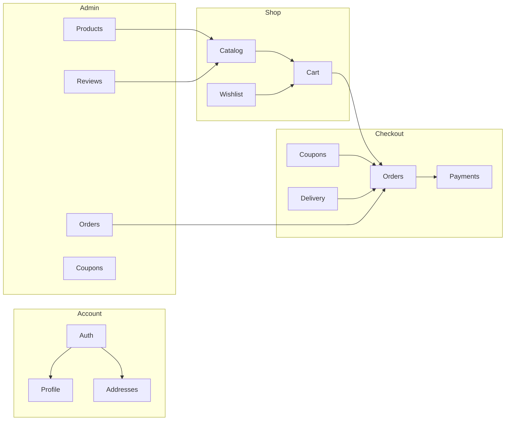

# Feature Documentation

End-to-end feature reference for the Natures Chakki e-commerce platform.

## Date and time

Backend timestamps remain UTC for database consistency. Angular globally renders `DatePipe` values in India Standard Time (`UTC+05:30`) for customer orders, Admin orders/payments/audit, registrations and timelines.

## Catalog

**Backend:** `ProductController` (`/api/product`), `SqlProductSearchService`

| Capability | Endpoint | Notes |
|------------|----------|-------|
| List products (paginated) | `GET /api/product?pageIndex=&pageSize=` | Filter by brand, type, sort |
| Product detail | `GET /api/product/{id}` | Includes images, reviews |
| Brands filter | `GET /api/product/brands` | Distinct brand names |
| Types filter | `GET /api/product/types` | Distinct product types |
| Admin CRUD | `/api/v1/admin/products` | Admin role required |

**Frontend:** `client/src/app/features/shop/`

- `shop.component.ts` — responsive 4/5-column desktop grid, product search with automatic empty/clear reset, filters and sorting
- `product-details.component.ts` — per-kg price, kg quantity/total and add-to-cart
- `product-item.component.ts` — compact per-kg product card

The global header search was removed; catalog search remains on the Shop page.

**Specification pattern:** `ProductSpecification`, `ProductSpecParams` in `Core/Specifications/`

---

## Shopping Cart

**Backend:** `CartController` (`/api/v1/cart`), `ICartService`

| Endpoint | Description |
|----------|-------------|
| `GET /api/v1/cart?id={cartId}` | Get cart (anonymous ID from localStorage) |
| `POST /api/v1/cart` | Create/update cart |
| `DELETE /api/v1/cart?id={cartId}` | Clear cart |
| `POST /api/v1/cart/items` | Authenticated add/set product quantity in kg |
| `DELETE /api/v1/cart/items/{productId}` | Authenticated item removal |

Cart stored in Memory or Redis (`CacheProvider`). Not in SQL. `Product.Price` is the authoritative price per kilogram. The API recalculates every line as `price per kg × quantity kg`, ignores client-submitted prices, merges duplicate products, and validates quantity using `Cart` configuration. The header badge counts distinct products, not total kilograms.

**Frontend:**

- `client/src/app/core/services/cart.service.ts`
- `client/src/app/features/cart/cart.component.ts`
- `client/src/app/features/cart/cart-drawer/cart-drawer.component.ts`

---

## Orders

**Backend:** `OrdersController`, `OrderService`

| Endpoint | Auth | Description |
|----------|------|-------------|
| `POST /api/v1/orders` | Bearer | Create order from cart items |
| `GET /api/v1/orders` | Bearer | List user orders |
| `GET /api/v1/orders/{id}` | Bearer | Order detail |
| `POST /api/v1/orders/{id}/cancel` | Bearer | Cancel + release inventory |

**Order creation flow:**

1. Validate cart items and stock (`InventoryService.HasAvailableStockAsync`)
2. Reload products and prices from SQL; frontend names/prices are ignored
3. Apply coupon if provided (`CouponService`)
4. Calculate subtotal, delivery, discount, total
5. In a serializable relational transaction, persist the COD order/items and deduct inventory
6. Commit, then clear the authenticated user's cart

Checkout currently supports **Cash on Delivery only**. Checkout becomes read-only after placement, prevents duplicate customer submissions, and restores the finalized confirmation after refresh. Standard Delivery is within 7 days and currently limited to Delhi NCR/Ghaziabad.

**Order lifecycle:** `Pending` → `PaymentReceived` (Paid) → `Processing` → `Packed` → `Shipped` → `OutForDelivery` → `Delivered`, plus `Cancelled`, `Refunded`, `Failed`. COD skips to `Processing`; Stripe webhook handling remains available for future online checkout. Admin updates delivery status and customers see the persisted timeline.

**Frontend:**

- `client/src/app/features/checkout/checkout.component.ts`
- `client/src/app/features/account/orders/orders.component.ts`
- `client/src/app/features/account/order-detail/order-detail.component.ts`

---

## Payments

**Backend:** `PaymentsController`, `StripePaymentService`

See [06-Payments.md](./06-Payments.md) for full Stripe flow.

Angular does not currently create a payment intent. Stripe APIs remain backend-only future capability; COD is Pending until delivery, Paid when Delivered, and Failed when cancelled/failed.

---

## Admin Panel

**Backend:** `AdminController` — `[Authorize(Roles = "Admin")]`

| Area | Endpoints |
|------|-----------|
| Dashboard | GET `/api/v1/admin/dashboard` — users, products, orders, revenue, payment counts, low stock, recent activity |
| Products | GET/POST/PUT/DELETE `/api/v1/admin/products` |
| Orders | GET orders, PUT status |
| Payments | GET `/api/v1/admin/payments` |
| Users | GET `/api/v1/admin/users` |
| Coupons | GET/POST `/api/v1/admin/coupons` |
| Reviews | GET pending, PUT moderate |
| Categories | Paged list, create, edit, activate/deactivate |
| Inventory | Paged stock view, adjustments, movement history |
| Reports | Date-filtered revenue, sales, COD, cancellations, best sellers |
| Audit & alerts | Administrative audit trail and operational alerts |

**Frontend:** `client/src/app/features/admin/`

- `dashboard.component.ts` — Welcome Back admin overview with summary cards
- `products.component.ts` — product management with generated internal SKU and validated image upload
- `orders.component.ts` — order/delivery status updates
- `payments.component.ts` — payment history
- `users/`, `categories/`, `inventory/`, `reports/`, `audit/`, `alerts/` — operational administration

See [11-Admin-Portal.md](./11-Admin-Portal.md) for API behavior, image-storage architecture, security boundaries, and operational flows.

**Access:** An account assigned the Admin role redirects to `/admin`. Production Admin credentials are provisioned through secure App Service settings during the one-time bootstrap.

---

## Wishlist

**Backend:** `WishlistController`, `WishlistService`

| Endpoint | Description |
|----------|-------------|
| `GET /api/v1/wishlist` | Get user wishlist |
| `POST /api/v1/wishlist/{productId}` | Add product |
| `DELETE /api/v1/wishlist/{productId}` | Remove product |

One wishlist per user (`Wishlists.UserId` unique index).

The wishlist backend/service remains, but no customer wishlist route is currently registered in `app.routes.ts`.

---

## Reviews

**Backend:** `ReviewsController`, `ReviewService`

| Endpoint | Description |
|----------|-------------|
| `GET /api/v1/reviews/product/{productId}` | Approved reviews for product |
| `POST /api/v1/reviews` | Submit review (authenticated) |

Reviews start as `ReviewStatus.Pending`. Admin moderates via `/api/v1/admin/reviews/pending` and `/api/v1/admin/reviews/{id}/moderate`.

---

## Coupons

**Backend:** `CouponsController`, `CouponService`

| Endpoint | Description |
|----------|-------------|
| `POST /api/v1/coupons/validate` | Validate code against order subtotal |

**Types** (`Core/Enums/CouponType.cs`):

- `Percentage` — percent off subtotal
- `FixedAmount` — flat discount (capped at subtotal)

Validation checks: active flag, expiry, minimum order amount, max usage count, per-user usage (`CouponUsage`).

Admin creates coupons via `/api/v1/admin/coupons`.

---

## Delivery Methods

**Backend:** `DeliveryMethodsController`

- `GET /api/v1/deliverymethods` — Standard Delivery (within 7 days; Delhi NCR/Ghaziabad notice)
- Seeded from `Infrastructure/Data/SeedData/delivery.json`

---

## Account & Addresses

**Backend:** `AccountController`

- Profile/session via `GET /api/v1/account/current` or `/current-user`
- Registration requires expiring email OTP verification before login
- OTP resend has cooldown, failed-attempt limits, and invalidates prior codes
- Customer Profile displays name, email, phone (when present), and latest order delivery address

**Frontend:** `client/src/app/features/account/`

- `profile.component.ts`
- `addresses.component.ts` exists in the UI; dedicated Account address CRUD endpoints are not currently implemented

---

## Inventory

**Backend:** `InventoryService`

- `ReserveStockAsync` / `ReleaseStockAsync` on order create/cancel
- `AdjustStockAsync` for admin stock updates
- Synced with `Product.QuantityInStock` and `Inventory` table
- COD placement deducts stock immediately; cancellation restores it and records inventory movement

---

## Contact

- Email: `info@natureschakki.in`
- Phones: `+91 9870514837`, `+91 9818213553`
- Address: `P.No-11, Senga Enclave, Girdharpur Road, Chhapraula, G.B. Nagar 201009`
- Facebook uses the verified supplied page URL; LinkedIn retains the current company URL

---

## Feature Map

```mermaid
flowchart LR
    subgraph Shop
        CAT[Catalog]
        CART[Cart]
        WL[Wishlist]
    end

    subgraph Checkout
        ORD[Orders]
        PAY[Payments]
        CPN[Coupons]
        DEL[Delivery]
    end

    subgraph Account
        AUTH[Auth]
        PROF[Profile]
        ADDR[Addresses]
    end

    subgraph Admin
        ADM_P[Products]
        ADM_O[Orders]
        ADM_R[Reviews]
        ADM_C[Coupons]
    end

    CAT --> CART
    CART --> ORD
    WL --> CART
    ORD --> PAY
    CPN --> ORD
    DEL --> ORD
    AUTH --> PROF
    AUTH --> ADDR
    ADM_P --> CAT
    ADM_O --> ORD
    ADM_R --> CAT
```
